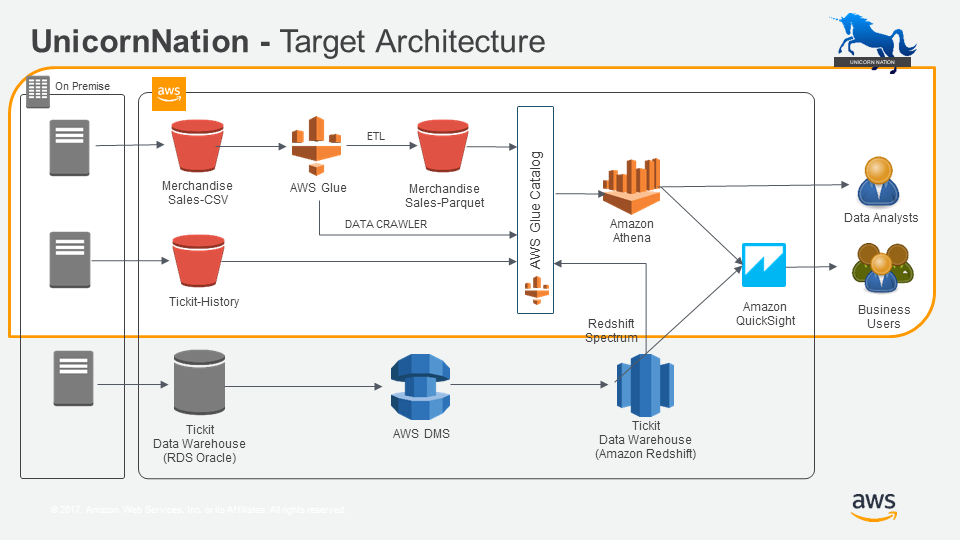

+++
title = "Creating a Glue Data Crawler"
date = 2021-02-17T17:04:42-06:00
weight = 2
chapter = false
pre = "<b>1. </b>"
+++

## Lab 1: Creating a Glue Data Crawler

### Overview

UnicornNation is a global entertainment company that provides ticketing, merchandising and promotion of large concerts and events. 

In recent years, they have been collecting data through a number of disparate systems and want to consolidate this data in a modern data architecture.

A workshop was held with the key stakeholders in UnicornNation and they identified three key data sources they would like to consolidate and have provided the funding and resources to build a Data Lake on AWS. 

During the course of this bootcamp, you will be building a Data Lake on AWS to meet their requirements and gain experience with a number of core AWS services, including S3, Glue, Athena, Redshift, Redshift Spectrum and QuickSight.

**UnicornNation Target Architecture**

*About the Labs*

With the following labs you will get hands-on experience with some of the key AWS services that underpin a Data Lake implementation. The labs are provided with step-by-step instructions that will help you use each service to build the basic build blocks of a data lake.
For the labs, you will be using your own computer and logging in to an AWS console through your web browser. 
