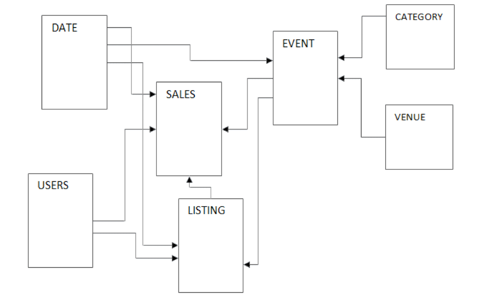

+++
title = "Working with Table Schemas"
date = 2021-02-17T17:04:42-06:00
weight = 3
chapter = false
pre = "<b>2. </b>"
+++

## Lab 2: Modifying Table Schemas

The IT team at UnicornNation has extracted historical data from their ticketing system, named “Tickit” which processes the majority of transactions for the company. This data source is known as the Tickit History.

They have stored this data in an S3 bucket and have created folder/prefixes for each table of data they have exported.
In this lab, we are going to create a Glue Data Crawler to crawl across this bucket. Once we have created the crawler, we are going to run it to determine the tables that are located in the bucket and add their definitions to the Glue Data Catalog.

In the first lab, the files we crawled were comma-delimited and there was a header row in each that provided the field names for the different columns.

In this example, we are going to create a Glue crawler on a more complex dataset, where the files are pipe-delimited and don’t have a header row with the column names.

This dataset is stored in an S3 Bucket with a folder/key for each table name. These tables make up the “Tickit” sample data set, which consists of seven tables: two fact tables and five dimension tables as shown below: 
 

This data set is the HISTORICAL data for the Tickit database—this data will not be used that often, so S3 is a great place to store and access this data.
